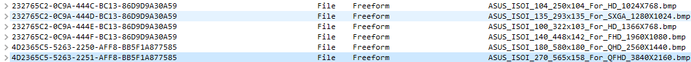

# Custom UEFI Splash Screen on Many Laptops Without Official Logo Customization

## DISCLAIMER:  
**I AM NOT RESPONSIBLE FOR ANY DEVICES THAT MIGHT BE BRICKED DURING THE REPLACEMENT PROCESS  
DO EVERYTHING AT YOUR OWN RISK. YOU HAVE BEEN WARNED**  
**Tested on:** ASUS VivoBook X571GT/A571GT, AMI Aptio V UEFI

**This guide is intended for laptops with UEFI firmware. Legacy BIOS firmware is outside the scope of this guide.**

**For simplicity, I will sometimes use the common term “BIOS” when referring to the laptop's UEFI firmware.**

### Introduction

So you decided that your laptop has nothing unique and doesn't appeal to you personally.  
That is understandable and I can absolutely relate to this. I thought the same, and it is the reason  
why I'm writing this guide in the first place. So people who are brave enough can add a bit of  
soul to their laptop.

However, as written in the disclaimer, it is quite dangerous for your hardware if not done carefully.  
If you're still not afraid - buckle up and let's make computers unique again.

### Prerequisites

To follow along you'll need several things:
  * Another computer
  * SPI programmer with SOIC-8 clip
  * [UEFITool 0.28](https://github.com/LongSoft/UEFITool/releases/tag/0.28.0)
  * [UEFITool NE](https://github.com/LongSoft/UEFITool)
  * [flashrom](https://www.flashrom.org/)
  * Set of screwdrivers

**UEFITool 0.28 with the legacy engine is required for the actual replacement operation. UEFITool NE cannot currently rebuild/edit the image,  
but it is useful for inspecting and validating both the original and modified firmware.**

### Process 

**1. Set up your programmer.**  

**Do not assume every flash chip is 3.3 V. Some laptop SPI flash devices operate at lower voltages such as 1.8 V.  
Verify the exact chip model and its voltage from the datasheet before connecting a programmer.  
A Raspberry Pi's SPI GPIO is 3.3 V and must not be connected directly to a lower-voltage flash device without appropriate level shifting.**

It can be either CH341A (not recommended), Raspberry Pi Pico running custom firmware  
or even a normal Raspberry Pi with enabled SPI in `raspi-config`. I will not focus on it here, you can  
find plenty of resources online about the topic and build process. In this guide I will be using Raspberry Pi 3B+  
as it is reliable, cheap, and was the only option I had.

**Warning for CH341A users: Do not assume a “3.3 V” jumper/socket means the SPI signal levels are 3.3 V. 
Some common black CH341A boards drive the SPI lines close to 5 V unless modified. 
Verify your programmer hardware before connecting it to the flash chip.**


**2. Disassemble the laptop**  

This doesn't need any explanation. Just power the laptop off, take the lid off, disconnect the battery and charger,  
drain leftover charge by holding power button for 10 seconds.  

Locate the SPI flash chip containing the system firmware. It is commonly an 8-pin SPI NOR device from manufacturers such as  
Winbond, Macronix, GigaDevice, or similar.  

**Read the complete chip marking and look up its datasheet before connecting anything.  
Do not identify it solely by its location on the motherboard.**  


**3. Read the firmware**  

**Do not turn your programmer on yet**

**If flashrom detects the chip inconsistently, reads differ, or verification fails, stop rather than repeatedly writing.**

Now you will have to connect your programmer to the BIOS chip. 

Pin 1 of an SOIC-8 package is normally marked by a dot or other package marking. Match pin 1 of the programmer/clip to pin 1 of the flash chip.  
Verify both the flash-chip datasheet and your programmer's pinout rather than relying only on wire color or clip orientation.

Here is the diagram:
```
          _________
CS#   1 -|*        |- 8  VCC
MISO  2 -|         |- 7  HOLD#/RESET#/IO3
WP#   3 -|         |- 6  CLK
GND   4 -|_________|- 5  MOSI
```

**Note: This is a common SPI NOR SOIC-8 pinout; always confirm the exact pin functions in your chip's datasheet before connecting it.**

After everything is connected, power on the programmer and connect it to the computer. In my case I will be connecting  
to mine via SSH. After everything is set up, you can check chip detection with the following command: 

For Raspberry Pi 3B+ or similar:
``` bash
sudo flashrom -p linux_spi:dev=/dev/spidev0.0,spispeed=512
```

For CH341A based programmers:
``` bash
sudo flashrom -p ch341a_spi
```

For Raspberry Pi Pico based programmers:
``` bash
flashrom -p serprog:dev=/dev/ttyACM0:115200
```

**Further in this guide I will not provide commands for each model of the programmer,  
the only thing that changes is the name of the programmer, I will use linux_spi:dev=/dev/spidev0.0,spispeed=512** 

After you run the command, it should show you the name of the chip you're connected to. If it doesn't - check your wiring.

Now you can actually read the firmware itself. For that, run the following command:

`sudo flashrom -p linux_spi:dev=/dev/spidev0.0,spispeed=512 -r backup1.bin`

**DO NOT DISCONNECT THE PROGRAMMER WHILE A READ IS IN PROGRESS. THE RESULTING DUMP WILL BE INCOMPLETE OR INVALID.**  
**It might take some time, so don't worry if it appears stuck - it is not**

**I HIGHLY RECOMMEND YOU TO CREATE MULTIPLE BACKUPS**

After you have as many backups as your internal paranoia desires, you should check them for corruption.  
This can be done by taking a sha256 hash of the file internals. You can do so with:  

`sha256sum backup1.bin backup2.bin backup3.bin ... backupN.bin`

```
cmp backup1.bin backup2.bin
cmp backup1.bin backup3.bin
```

If all hashes are exactly the same and cmp printed nothing and exited successfully - you're ready to go to the next step.  
However, before that, compare size of the dump with capacity of the flash. They have to be equal. 

**Note: Always modify a verified dump read from your own laptop. Do not use a BIOS update downloaded from the manufacturer's website  
as the base image unless you have specifically verified that it is a complete raw flash image with the same layout.  
Vendor update files may contain capsules, headers, partial firmware regions, or other packaging.**

**4. Modification of the firmware**

**The following image-discovery steps are specific to the firmware layout on my ASUS X571GT/A571GT.  
Other manufacturers may store the splash logo in a different section, use another image format,  
omit filenames/extensions entirely, or generate the image differently. In my testing,  
I have also seen similar BMP/freeform-resource layouts in firmware from multiple manufacturers using AMI-based firmware.  
Do not assume your machine uses the same layout, however.**  

Now comes the most interesting part - modifying the firmware itself to include your custom logo.  
Launch UEFITool, press Ctrl+O and open your original firmware in it. There may already be warnings in the Parsing section.  
Take note of them so you can compare the original image with the modified image later.  
Press Ctrl+F, go to `Text` section and look for `.bmp`. It should find  
sections that contain this text. On my firmware, searching for `.bmp` finds UI/string references  
associated with the bitmap resources. If your firmware produces no useful results, its logo may be stored or referenced differently.  
For my particular laptop - Asus X571GT/A571GT - it was very easy to find the values:  
  

After you located these, expand the volume and potentially LZMA-compressed section.  
On my firmware, each matching entry contains a UI section and a Freeform subtype GUID section holding the image data.  
Right-click on it and click on `Extract body`, extract into the file.  
When extracted, open it with any image viewer to make sure that it is the correct image. If not - skip and go to the next result.  
Repeat until you have found all confirmed copies/variants of the stock splash logo. In my case there are multiple entries with images  
for screens with different resolutions. Yours might be different, but you will need to find all the entries where splash screen image appears.  
They are usually grouped, as in my case.  

When you found and extracted all the images, check the resolution of each one. For the safest replacement, match the original image's dimensions,  
bit depth, BMP compression type, and preferably its overall file/body size. For example, if the original is an uncompressed 24-bit BMP,  
export the replacement as an uncompressed 24-bit BMP with exactly the same dimensions. Once you have prepared all the custom BMPs  
(you can edit it in any image editor and export as BMP, that's important), you can open UEFITool again.  
Now you will have to go to each image entry's `Data` section, right-click on it, and click `Replace body`. Select your BMP with matching resolution  
and confirm. On Windows you might need to switch filter from `*.bin` to `All` so your BMP files are visible.  

Repeat until you have found and replaced all confirmed copies/variants of the stock splash logo.

**Note: Some firmware contains several copies of the same splash logo intended for different display modes or boot paths.  
Replacing every confirmed variant helps prevent the firmware from selecting an untouched stock logo.**  

Click `File->Save Image File` and save it as something different from your original backup name.  

After saving, compare size of the modified firmware with the size of the original dump. Their sizes have to be exactly equal.  

I also strongly recommend opening both the original and modified images in UEFITool NE.  
Compare the parser messages and make sure the modified image does not introduce new structural/parsing errors that were absent from the original.

You're done with the hardest part, congrats!  

**5. Flashing the modified BIOS image**  

Back to your laptop you want to modify. If you disconnected the programmer after reading the firmware, it is fine, just reconnect it back.  
If not -- let's continue.  

Open your terminal and type command:  

`sudo flashrom -p linux_spi:dev=/dev/spidev0.0,spispeed=512 -w patched.bin`  

**DO NOT DISCONNECT POWER OR THE PROGRAMMER DURING A WRITE. AN INTERRUPTED WRITE MAY LEAVE THE LAPTOP UNBOOTABLE.**  
**It will take longer than reading because it needs to read flash, write to it and verify integrity of the flashed image**  

Everything should go successfully. If you've done everything correctly - you should be able to disconnect programmer from power,   
detach it from the BIOS chip and reconnect battery to the laptop. First boot might take longer than usual, but as long as everything is done correctly -  
it should turn on and show you your custom splash image.  

**Congratulations!**

**Note: if the computer boots successfully, but the logo doesn't appear - check firmware options such as FastBoot or Quiet Boot in UEFI settings**  

### Going back to original firmware  

Whether you messed up the installation or just want to revert everything back - it is easy to do.  
You will need to follow steps 1 and 2 of the guide and connect the programmer to the chip as in the beginning of step 3.  
After that just flash your backed up image with:  

`sudo flashrom -p linux_spi:dev=/dev/spidev0.0,spispeed=512 -w backup.bin`  

Then follow steps from the last paragraph of the step 5.  

You're done!
